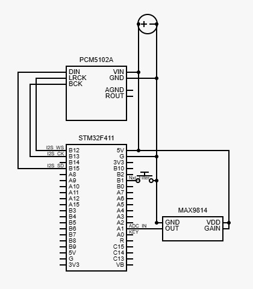

# Falando Por AI
## O que é
O projeto é de um modulador de voz portátil em tempo real. Ele se baseia em um microcontrolador STM32 para processamento de sinal de áudio e coordenação dos outros componentes.
Usamos um microfone de eletreto para capturar sinais de voz, o conversor ADC do próprio STM32 para digitalizar o sinal, e um módulo DAC para conversão do audio digital processado de volta em analógico. O código é um projeto padrão do STM32CubeIDE, nossa ferramenta principal de desenvovimento.

## Como usar
Para usar nosso pojeto você precisará de alguns componentes essênciais:
-  STM32F411CEU6 (STM32 Blackpill)
-  MAX9814 (Módulo Microfone Eletreto com Amplificador) 
-  PCM5102A (Módulo Conversor DAC) ([IMPORTANTE!](#DAC))
  
>Outras placas STM32 com: ADC de 12 bits, timer, interface I²S podem ser usadam, mas a configuração dos periféricos tem de ser feita manualmente nesses casos. Mais detalhes na sessão [Configuração de periféricos](#config_perifericos)

Para usar nosso código recomendamos o uso do STM32CubeIDE que irá facilitar a importação do código e configuração dos perifericos do seu STM32.
Com seu STM32CubeIDE baixado, basta clonar o nosso repositório em qualquer pasta do seu armazenamento e importar o projeto usando a IDE. Para fazer isso, abra a IDE e vá em File->Import, escolha a opção General->Existing Projects into Workspace, seleciona a pasta do repositório clonado em "Select root directory" e clique em "Finish".
>Também é possível usar outras IDEs e ferramentas (Por exemplo, PlatformIO) para compilar e fazer upload do código para a placa, mas isso exige configurações adicionais que não serão explicadas aqui.

Com o código importado na sua IDE, basta conectar sua placa de desenvolvimento em um programador e upar o código para seu STM.

Em seguida, conecte os componentes conforme a imagem a seguir:



Por fim, alimente o seu STM32 e use um fone de ouvido na entrada p2 do seu DAC para escutar os efeitos aplicados na sua voz.

O botão conectado ao pino B1 muda para o próximo efeito de voz de forma cíclica. A ordem padrão é: Darth Vader -> Optimus Prime -> Passa baixa (voz longe) -> Passa alta (efeito de rádio) -> Low pitch shift (voz grossa) -> High pitch shift (voz aguda). 

# Como funciona

## Componentes
O arquivo "Componentes.md" na raiz desse repositório tem uma coletãnea de informações úteis sobre os componentes usados no projeto.

### <a id="DAC"></a>Informações importantes sobre o módulo DAC 5102A

>Caso queira pular a explicação, [clique aqui](#DAC_skip).

O embora o CHIP DAC 5102A tenha um datasheet extenso e de fácil acesso, a documentação do MÓDULO usado no projeto (plaquinha roxa com o chip 5102A e outros componentes pré-soldados) é muito mais escassa. A melhor documentação que encontramos foi [este pdf](https://macsbug.wordpress.com/wp-content/uploads/2021/02/pcm5102a_dac_schematic.pdf) do blog japonês [macsbug](macsbug.wordpress.com).

Basicamente, o módulo possui pinos numerados de 1 a 4 na parte de cima da placa, que correspondem aos pinos FLT, DEMP, XSMT e FMT do chip 5102A, respectivamente. Na parte inferior da placa existem 4 conjuntos de 3 contatos nomeados HxL, com x variande de 1 a 4.

- O contato próximo à letra H (de High) está conectado à tensão de entrada da placa.
- O contato próximo à letra L (de Low) está conectado ao ground da placa
- O contato do meio está conectado ao pino de número correspondente (e.g, o contato do meio do conjunto H1L está conectado ao pino FLT do chip)

Para a maioria das aplicações com o chip 5102A (incluindo este projeto) a tensão desses pinos não varia, então para evitar o uso de fios ligando esses pinos nas respectivas tensões, a tensão dos pinos pode ser configurada soldando um contato permanente entre os contatos do meio e os contatos de H ou L. Caso isso não seja feito, é necessário usar fios.

Na parte de cima da placa, próximo aos pinos SCK e BCK, também é possível ver uma dupla de contatos que estão internamente ligados ao pino SCK e ao ground da placa. De forma similar, esses contatos também foram projetados para fechar um contato permanente com solda entre SCK e GND da placa, ativando o modo de "geração automática de clock" (ver datasheet do ship 5102A para mais informações).

<a id="DAC_skip"></a>Para este projeto, soldamos os contatos exatamente como mostra [este pdf](https://macsbug.wordpress.com/wp-content/uploads/2021/02/pcm5102a_dac_schematic.pdf), ou seja:
- Pinos 1, 2 e 4 ligados em L (GND)
- Pino 3 ligado em H (Vin)
- Pino SCK ligado em GND (contato de cima da placa fechado com solda)
## Processo

### Pipeline de processamento de áudio
O sinal de áudio (analógico) é capturado pelo microfone e convertido em sinal digital pelo conversor ADC do STM32. O sinal digital é então processado usando diversos filtros de áudio pelo STM32, e então transmitido através do protocolo I²S para o módulo DAC, onde é convertido novamente para um sinal analógico.

A transmissão de dados entre o ADC e a memória e entre a memória e o DAC (pelo protocolo I²S) é feita através de canais DMA do STM32.

### <a id="config_perifericos"></a>Configuração dos periféricos do STM32
Todos os periféricos usados da placa foram configurados através da interface gráfica do STM32CubeIDE. é possível ver e modificar essas configurações abrindo o arquivo "Falando por AI.ioc" (na raíz do repositório) pelo STM32CubeIDE.

Abaixo está um resumo das configurações. Opções não mencionadas foram deixadas como padrão.

#### Clocks (aba Clock Configuration da STM32CubeIDE)
HCLK foi configurado para 48MHz, frequência suficiente para processar todos os filtros implementados em tempo real. (Ao definir este valor, a IDE configurou automaticamente outras configurações de clock necessárias).

APB1 Prescaler e APB2 Prescaler foram definidos como "/4" para que a frequência dos timer fosse de 24MHz.

#### I2S2
A interface I2S2 foi configurada para transmitir continuamente dados de áudio de 16 bits em uma frequência de 48kHz pelo protocolo Philips 2²S usando um canal DMA.
Algumas modificações foram feitas nos pinos para maior conveniência na hora da montagem.

- Mode: Half-Duplex Master
- Transmission Mode: Mode Maser Transmit
- Communication Standard: I2S Philips
- Data and Frame Format: 16 Bits Data on 16 Bits Frame
- Selexted Audio Frequency: 48 KHz (real audio frequency 47,348 kHz)
- DMA Settings:
  - Mode Circular
  - Increment Address: ligado apenas em "Memory"
  - Data Width: Half Word | Half Word
- <a id="I2S_pins"></a>GPIO Settings:
  - PB12: I2S2_WS
  - PB13: I2S2_CK
  - PB15: I2S2_SD

#### Timer 2 (TIM2)
O timer 2 foi configurado para gerar um sinal (Update Event) em uma frequência de 47,904 Hz (proxima da frequência de transmissão de áudio de 48kHz). este sinal será usado para começar uma conversão do ADC, gerando assim uma taxa de amostragem de (aproximadamente) 48kHz.

O contador conta até 501, com uma frequência de 24MHz (frequência configurada para APB timer clock), e gera um evento sinal toda vez que sua contagem chega em 501 e reinicia do 0.

A saída do timer não está atrelada a nenhum pino.

- CLK = 24MHz (Tanto ABP1 Timer clocks quanto ABP2 Timer clocks)
- Canais = nenhum (apenas contador. sem comparação)
- Prescaler = 0
- Modo = Up
- Counter Period = 501 (24Mhz/501 = 47,904kHz, frequência maior que a frequência de transmissão do I²S)

#### ADC1
O ADC1 foi configurado para funcionar com sua resolução máxima (12 bits), iniciar conversões quando sempre que ocorrer um evento de atualização do Timer 2, e transmitir 
dados para memória através de um canal DMA. A leitura é feita pelo pino A1;

- IN1 habilitada (pino PA1)
- Mode: Independent mode
- Clock Prescaler: PCLK2 divided by 2
- Resolution: 12 bits
- Data Alignment: right alignment (padrão)
- DMA Continuous Requests: Enabled
- External Trigger Conversion Source: Timer 2 Trigger Out event
- DMA Settings:
  - Mode: Normal
  - Data Width: Half Word | Half Word

>Note que é necessário configurar o canal DMA na aba "DMA Settings" antes de configurar a opção "DMA Continuous Requests"

#### GPIO
Além dos [pinos da interface I²S](#I2S_pins), O pino A1 foi configurado no modo como entrada para o canal 1 do ADC e o pino B1 foi configurado como donte de interrupção externa.

O pino C13, conectado ao LED integrado na placa, foi configurado como saída digital para permitir sinalização de erro.

### Interrupções
O loop principal do programa (loop infinito na função main()) é vazio por todo o processamento acontece de forma assíncrona por meio de callbacks de interrupção.

Em especial, as funções callback mais relevantes são as que ocorrem quando a interface I¹S transmite uma transferência completa e meia transferência.

### Double buffering
Afim de otimizar o tempo de processamento, o projeto usa uma abordagem de [*double buffering*](https://www.tecmundo.com.br/video/1410-o-que-e-double-buffering-.htm).

Existe um buffer de entrada de dados (IN_BUFFER) e um buffer de saída de dados (OUT_BUFFER). Enquanto a interface I²S transmite a primeira metade do buffer de saída, o áudio na segunda metade do buffer de entrada é processado, e colocado na segunda metade do buffer de saída. Enquanto isso, a primeira metade do buffer de entrada é escrita pelo ADC.

Quando a primeira metade do buffer de saída é transmitida, essa lógica se inverte.

O OUT_BUFFER tem o dobro do tamanho do IN_BUFFER, pois o protocolo I²S espera receber 2 sinais de áudio para transmitir áudio estéreo (um sinal para o canal esquerdo e outro para o canal direito). Na prática, como o microfone só capta um canal de som, o sinal processado é simplesmente colocado duas vezes no buffer de saída, resultando no mesmo som nos dois canais de áudio.

Como a frequência de conversão do ADC é ligeiramente maior que a frequência de transmissão do I²S, é garantido que o I²S sempre tenha um buffer (ou uma metade de buffer) cheia para transmitir.

### Ciclo de processamento
Suponha que a interface I²S tenha acabado de transmitir um buffer completo de dados. A função de callback ```HAL_I2S_TxCpltCallback``` é chamada, com o trecho de código abaixo (o arquivo Core/Src/stm32f4xx_it.c que contém as callbacks de interrupção).

Considere também que BUFFER_SIZE é 1024, ou seja, o buffer de entrada guarda um total de 1024 samples de áudio, enquanto o buffer de saída guarda 2048 (porque o sinal de saída é estereo).

```C++
void HAL_I2S_TxCpltCallback (I2S_HandleTypeDef * hi2s)
{
	count++;
	if (count==48)
	{
		count = 0;
		HAL_GPIO_TogglePin(LED_GPIO_Port, LED_Pin);
	}
	process_in_buffer = &(IN_BUFFER[BUFFER_SIZE/2]);
	process_out_buffer = &(OUT_BUFFER[BUFFER_SIZE]);
	HAL_ADC_Start_DMA(&hadc1, (uint32_t*) &(IN_BUFFER[0]), BUFFER_SIZE/2);
	processHalfBuffer();
}
```
A cada 48 buffers transmitidos, o LED da placa acende ou apaga. 1024*48 $\approx$ 48k. Com uma frequência de 48kHz, significa que o LED acende ou apaga a cada 1 segundo. Isso indica que o processamento de áudio está acontecendo de forma correta.

Após incrementar a variável "count", a função troca as metades sendo processadas dos buffers para a segunda metade, e inicia a transmissão de dados do ADC para a primeira metade do buffer de entrada, enquanto a interface I²S automaticamente começa a transmitir a primeira metade do buffer de saída, que já está processado.

Por fim, a função ```processHalfBuffer()``` é chamada. Seu código é como abaixo (presente no arquivo Core/Src/audio_processing.c):
```C
void processHalfBuffer()
{
	uint16_t int_input = 0;
	float normalized_input = 0.0;
	float normalized_output = 0.0;
	int16_t int_output = 0;

	uint16_t i = 0;
	for (i=0; i<BUFFER_SIZE/2; i++)
	{
		int_input = process_in_buffer[i];
		normalized_input = normalizeAudio(int_input);
		normalized_output = processAudio(normalized_input) * OUTPUT_VOLUME; // COLOCAR EFEITO AQUI
		int_output = deNormalizeAudio(normalized_output) ;
		process_out_buffer[2*i] = int_output;
		process_out_buffer[2*i+1] = int_output;
	}

	return;
}
```
Esta função lê uma sample da metade do buffer a ser processada atualmente, no formato de um uint_16, normaiza esse valore convertendo-o para um float entre -1 e +1 (processamento de áudio com valores float é mais fácil, embora mais lento, que com valores inteiros), processa o sinal normalizado através da função ```processAudio()```, que aplica o filtro desejado, converte o resultado para um valor inteiro com sinal (que é o formato esperado pelo protocolo I²S) e coloca o resultado final nos 2 próximos índices do buffer de saída (para imitar uma saída estereo).

Essa sequência se repete até que metade do buffer de entrada tenha sido processada.

A função ```processAudio()``` (no mesmo arquivo) é simplesmente um bloco switch-case que chama a função de aplicação do filtro selecionado na entrada normalizada.


## Organização do Repositório
A maioria dos arquivos nesse repositório são gerados automaticamente para todo projeto na STM32CubeIDE.

Os arquivos de cabeçalho (.h) relevantes para o projeto se encontram na pastas Core/Inc. Os arquivos de implementação (.c) se encontram na pasta Core/Src.

Um sumário dos arquivos mais importantes para o projeto:
- audio_processing.h/c - contém funções para o pipeline de processamento de áudio
- filters.h/c - Contém funções para configuração e uso dos filtros implementados
- stm32f4xx_it.h/c - Contém as funções de callback para todas as interrupções usadas.

A pasta filter_testing contém um exemplo do uso dos arquivos filter.h/c em um arquivo de áudio .wav.

# Filtros e clonagem de voz
A implementação dos filtros foi feita de forma que eles possam ser acoplados e desacoplados em qualquer projeto similar a este. Da forma como foi construída, as funções de filtro esperam receber amostras (um único valor por vez) sequenciais e normalizadas (*floats* entre -1.0 e 1.0) de um buffer de áudio, retornando as amostras com os filtros aplicados. Em outras palavras, seria possível, a título de exemplo, criar um programa em C usando os mesmos arquivos de filtro deste projeto (Filtro.h e Filtro.C) que leia um arquivo na extensão WAV, normalize os dados de áudio, aplique os filtros em cada amostra de dado e retorne o arquivo de áudio reconstruído, com o filtro aplicado. Uma aplicação dessa natureza pode ser vista na pasta `filter_testing`, especificamente em `filter_testing/filter_test.c`, onde experimentamos as implementações iniciais do filtro do **Darth Vader** em um arquivo de extensão WAV. 

De forma adicional, este projeto se propôs a usar uma aplicação de Inteligência Artificial (IA) que clone a voz de qualquer pessoa. Entretanto, foram encontrados desafios ao tentar embarcar o modelo de IA no hardware do projeto, de forma que esta ideia fosse invibializada, sendo um possível desafio para projetos futuros. Por consequência, a aplicação de IA foi implementada à parte, em um hardware externo (um notebook com placa de vídeo dedicada).

## Explicação dos Filtros:

### 1. Filtro Passa Baixa ⬇️:

O código a seguir implementa um **filtro passa-baixa (Low-Pass Filter - LPF)** de primeira ordem.

```cpp
// Initialize the low-pass filter
void lpf_init(LPF *f, float cutoff_freq, float sample_rate) {
    float dt = 1.0f / sample_rate;                  // Time step
    float RC = 1.0f / (2.0f * M_PI * cutoff_freq);  // RC time constant
    f->alpha = dt / (RC + dt);                      // Alpha coefficient
    f->prev = 0.0f;                                 // Previous output sample
}
```

A função `lpf_init` é responsável por configurar e inicializar as variáveis do filtro antes que ele possa ser usado. Ela alcula o **passo de tempo (`dt`)** ou o intervalo de tempo entre duas amostras consecutivas do áudio (inverso da taxa de amostragem). A fórmula $f_c=\frac{1}{2\pi RC}$ define a frequência de corte, e o código está apenas a rearranjando para encontrar RC a partir da `cutoff_freq`. E, por fim, o passo mais importante: calcula o coeficiente de suavização **`alpha`**. Este valor, que varia entre 0 e 1, determina o quão "forte" é o filtro.

```cpp
// Apply low-pass filter
float apply_lpf(LPF *f, float x) {
    float y = f->alpha * x + (1.0f - f->alpha) * f->prev; // Apply low-pass filter formula
    f->prev = y;                                          // Update previous output sample
    return y;
}
```

`float y = f->alpha * x + (1.0f - f->alpha) * f->prev;` Esta é a **equação do filtro** em si. A nova amostra de saída (`y`) é uma **média ponderada** entre a amostra de entrada atual (`x`) e a amostra de saída anterior (`f->prev`). O coeficiente `alpha` controla o peso. A saída é uma combinação de `alpha` por cento da nova amostra e `(1 - alpha)` por cento da saída anterior.

### 2. Filtro Passa Alta ⬆️:

O código a seguir implementa um **filtro passa-alta (High-Pass Filter - HPF)**.

```cpp
void hpf_init(HPF *f, float cutoff_freq, float sample_rate) {
    float dt = 1.0f / sample_rate;                  // Time step
    float RC = 1.0f / (2.0f * M_PI * cutoff_freq);  // RC time constant
    f->alpha = RC / (RC + dt);                      // Alpha coefficient
    f->prev_x = 0.0f;                               // Previous input sample
    f->prev_y = 0.0f;                               // Previous output sample
}
```

A função `hpf_init` prepara as variáveis necessárias para o filtro, de forma muito similar à `lpf_init`.

```cpp
float apply_hpf(HPF *f, float x) {
    float y = f->alpha * (f->prev_y + x - f->prev_x);   // Apply high-pass filter formula
    f->prev_x = x;                                      // Update previous input sample
    f->prev_y = y;                                      // Update previous output sample
    return y;
}
```

E a função `apply_hpf` também funciona de maneira similar à `lpf_apply`.

### 3. Distorção 〰️:

Este código implementa um dos efeitos de distorção de áudio mais simples e conhecidos: o **hard clipping** (ou ceifamento/corte abrupto). Diferente dos outros filtros, esse filtro não precisa de uma *struct* de controle.

```cpp
float apply_distortion(float x, float threshold) {
    if (x > threshold) return threshold;    // Clamp to threshold
    if (x < -threshold) return -threshold;  // Clamp to negative threshold
    return x;
}
```

**`if (x > threshold) return threshold;`** : Se o valor da amostra de entrada (`x`) for **maior** que o limiar positivo (`threshold`), a função não retorna o valor original `x`, mas sim o próprio valor do `threshold`.

**`if (x < -threshold) return -threshold;`** : Da mesma forma, se o valor da amostra for **menor** que o limiar negativo (`-threshold`), a função retorna o valor `-threshold`.

**`return x;`** : Se a amostra estiver **dentro** dos limites (entre `-threshold` e `threshold`), ela passa pelo efeito sem nenhuma alteração.

### 4. Eco 🗣:

O código apresentado implementa um efeito de **eco** , também conhecido como **delay digital**. Este é um dos efeitos de áudio mais fundamentais, baseado no conceito de armazenar um som e reproduzi-lo um pouco mais tarde.

```cpp
// Initialize the echo effect
// This function sets up the echo effect with a delay time and decay factor.
void echo_init(Echo* e, float delay_ms, float decay, float sample_rate) {
    e->delay_samples = (int)(sample_rate * delay_ms / 1000.0f);                     // Convert delay time to samples
    if (e->delay_samples > MAX_DELAY_SAMPLES) e->delay_samples = MAX_DELAY_SAMPLES; // Clamp to max size
    e->size = e->delay_samples;                                                     // Set size
    e->index = 0;                                                                   // Reset index  
    e->decay = decay;                                                               // Set decay factor
    memset(e->buffer, 0, sizeof(e->buffer));                                        // Clear buffer
}
```

**`e->delay_samples = (int)(sample_rate * delay_ms / 1000.0f);`**: Esta linha converte o tempo de atraso de milissegundos para o número correspondente de **amostras de áudio**. Por exemplo, com uma taxa de 44100 Hz e um delay de 500 ms, o eco precisará de `44100 * 500 / 1000 = 22050` amostras de atraso.

**`if (e->delay_samples > MAX_DELAY_SAMPLES) ...`**: Uma verificação de segurança para garantir que o tempo de atraso solicitado não exceda o tamanho máximo do *buffer* de memória alocado (`MAX_DELAY_SAMPLES`), evitando erros de acesso à memória.

**`memset(e->buffer, 0, sizeof(e->buffer));`**: Limpa completamente o *buffer* de áudio, preenchendo-o com zeros. Isso é crucial para garantir que não haja sons indesejados (lixo de memória) no início da aplicação do efeito.

```cpp
float apply_echo(Echo* e, float x) {
    float delayed = e->buffer[e->index];    // Get delayed sample
    float y = x + delayed * e->decay;       // Apply decay to delayed sample

    e->buffer[e->index] = y;                // Store new sample in buffer
    e->index = (e->index + 1) % e->size;    // Increment index circularly

    return y;
}

```

**`float delayed = e->buffer[e->index];`**: Lê uma amostra do *buffer* na posição atual do índice (`e->index`). Esta amostra é o som que foi armazenado `delay_samples` amostras atrás no tempo — ou seja, é o **som atrasado**.

**`float y = x + delayed * e->decay;`**: Calcula a nova amostra de saída (`y`). Ela é a **soma** da amostra de entrada atual (`x`) com a amostra atrasada (`delayed`), que por sua vez é multiplicada pelo fator de decaimento (`e->decay`) para reduzir seu volume.

**`e->buffer[e->index] = y;`**: **Armazena a nova amostra de saída (`y`) de volta no buffer**, na mesma posição de onde a amostra atrasada foi lida. Isso é o que cria as repetições contínuas (feedback). O som recém-criado será lido novamente no futuro para gerar o próximo eco.

### 5. Reverb 📳:

O código implementa uma forma simplificada de **reverberação** (reverb), baseada em uma única linha de atraso com realimentação (*feedback*).

```cpp
// Initialize the reverb effect
void reverb_init(Reverb* r, float delay_ms, float feedback, float mix, float sample_rate) {
    int delay_samples = (int)(sample_rate * delay_ms / 1000.0f);                // Convert delay time to samples
    if (delay_samples > MAX_DELAY_SAMPLES) delay_samples = MAX_DELAY_SAMPLES;   // Clamp to max size
    r->size = delay_samples;                                                    // Set size
    r->index = 0;                                                               // Reset index
    r->feedback = feedback;                                                     // Set feedback amount           
    r->mix = mix;                                                               // Set mix amount             
    memset(r->buffer, 0, sizeof(r->buffer));                                    // Clear buffer
}
```

A função `reverb_init` prepara o efeito, de maneira quase idêntica à do eco, mas com a adição de um novo parâmetro: `mix`.

`float mix`: O nível de mistura. Controla a proporção entre o som original e o som com efeito. Um valor de 0 significa nenhum reverb, e 1 significa apenas o som do reverb.

```cpp
float apply_reverb(Reverb* r, float x) {
    float delayed = r->buffer[r->index];                // Get delayed sample
    float y = x * (1.0f - r->mix) + delayed * r->mix;   // Mix input with delayed sample

    r->buffer[r->index] = x + delayed * r->feedback;    // Store new sample in buffer
    r->index = (r->index + 1) % r->size;                // Increment index circularly

    return y;
}
```

**`float y = x * (1.0f - r->mix) + delayed * r->mix;`**: Esta é a linha de **mistura da saída**. Ela calcula o que o ouvinte irá escutar.

* `x * (1.0f - r->mix)`: Pega a amostra de entrada (`x`) e a multiplica pela proporção de som sem efeito (`1 - mix`).
* `delayed * r->mix`: Pega a amostra atrasada (`delayed`) e a multiplica pela proporção de som com efeito (`mix`).
* O resultado `y` é a soma ponderada do som original e do som reverberado. Este controle de `mix` é típico de efeitos de reverb e permite ajustar o quão "distante" o som parece estar.

**`r->buffer[r->index] = x + delayed * r->feedback;`**: Esta é a linha da **realimentação (feedback)**. Ela calcula o que será armazenado de volta no buffer para criar as próximas reflexões. No eco, a *saída final* era armazenada de volta no buffer. Aqui, o que é armazenado é a **soma da entrada atual (`x`) com a reflexão anterior atenuada (`delayed * r->feedback`)**.

### 6. Pitch Shifter ◀️▶️:

Este código implementa um efeito de **pitch shifter**, que altera a "altura" (a frequência fundamental) de um som.

```cpp
// Initialize the pitch shifter
// pitch_factor: e.g. 0.7 for ~7 semitones down
void pitchshifter_init(PitchShifter* ps, float pitch_factor, float sample_rate) {
    memset(ps->buffer, 0, sizeof(ps->buffer));  // Clear buffer
    ps->write_index = 0;                        // Reset write index
    ps->read_index = 0.0f;                      // Reset read index
    ps->pitch_factor = pitch_factor;            // Set pitch factor
    ps->size = MAX_DELAY_SAMPLES;               // Set size to max delay samples
}
```

`float pitch_factor`: O **fator de afinação**. Este é o número mais importante.

* Um `pitch_factor` de **1.0** não altera o som.
* Um `pitch_factor` **< 1.0** (ex: 0.5) **diminui** a afinação (som mais grave).
* Um `pitch_factor` **> 1.0** (ex: 2.0) **aumenta** a afinação (som mais agudo).

`int size`: O tamanho do *buffer* de memória que será usado para armazenar o áudio temporariamente.

**`ps->read_index = 0.0f;`** : Inicializa o **ponteiro de leitura** . Note que ele é um `float`, pois ele se moverá em incrementos fracionários para alcançar a mudança de velocidade.

**`ps->write_index = 0;`** : Inicializa o **ponteiro de escrita** . Este é um `int` porque ele sempre se move uma amostra por vez.

```cpp
// Linear interpolation helper
static float lerp(float a, float b, float t) {
    return a + t * (b - a);
}

// Process one sample with pitch shifting down
float apply_pitchshifter(PitchShifter* ps, float input) {
    ps->buffer[ps->write_index] = input;                    // Store input sample in buffer 

    // Calculate read index
    float output = 0.0f;                                    // Read sample at slower rate for pitch down
    int idx1 = (int)ps->read_index;                         // Get integer part of read index
    int idx2 = (idx1 + 1) % ps->size;                       // Get next index circularly
    float frac = ps->read_index - idx1;                     // Fractional part for interpolation

    // Linear interpolate between two samples
    output = lerp(ps->buffer[idx1], ps->buffer[idx2], frac);

    // Increment write index
    ps->write_index = (ps->write_index + 1) % ps->size;

    // Increment read index slower for pitch down
    ps->read_index += ps->pitch_factor;
    if (ps->read_index >= ps->size) {
        ps->read_index -= ps->size;
    }

    return output;
}
```

**Leitura e Interpolação**: Como o ponteiro de leitura (`read_index`) é um `float`, ele raramente cairá exatamente em uma posição inteira do *buffer*. Tentar ler o valor de `buffer[10.5]` não é possível. A solução é a **interpolação linear**.

* `int idx1 = (int)ps->read_index;`: Pega a parte inteira do ponteiro de leitura (ex: 10).
* `int idx2 = (idx1 + 1) % ps->size;`: Pega o próximo índice no *buffer* (ex: 11).
* `float frac = ps->read_index - idx1;`: Pega a parte fracionária (ex: 0.5).
* `output = lerp(ps->buffer[idx1], ps->buffer[idx2], frac);`: A função `lerp` (Interpolação Linear) calcula um valor intermediário. Se `frac` é 0.5, ela retorna a média exata entre o valor em `idx1` e `idx2`. Isso "adivinha" qual seria o valor da onda sonora no ponto fracionário, resultando em um som muito mais suave do que simplesmente arredondar o índice.

`ps->write_index = (ps->write_index + 1) % ps->size;`: O ponteiro de escrita **sempre avança de 1 em 1**, seguindo o ritmo normal do áudio.

`ps->read_index += ps->pitch_factor;`: O ponteiro de leitura **avança na velocidade do `pitch_factor`**.

* Se `pitch_factor` é 0.5, o ponteiro de leitura se move na metade da velocidade do de escrita. Ele está "lendo o passado" mais devagar, o que estica a onda sonora, resultando em um som mais grave.
* Se `pitch_factor` é 2.0, ele lê duas vezes mais rápido, "pulando" amostras. Isso comprime a onda sonora, resultando em um som mais agudo.

### 7. Filtros customizados:

Todos os filtros customizados não introduzem um novo tipo de processamento de áudio, mas sim criam uma **cadeia de efeitos** (*effect chain*), combinando vários dos filtros e efeitos que vimos anteriormente para alcançar um resultado sonoro final, como por exemplo o efeito do **Darth Vader**.

```cpp
float apply_darthvader(DarthVader* dv, float x) {

    x = apply_pitchshifter(&dv->ps, x);                 // Apply pitch shifter
    x = apply_distortion(x, dv->distortion_threshold);  // Apply distortion
    x = apply_equalizer(&dv->eq, x);                    // then equalizer
    x = apply_reverb(&dv->reverb, x);                   // reverb
    x = apply_volume_gain(x, dv->volume_gain);          // volume gain last

    return x;
}
```

---
## Clonagem de Voz por IA

A clonegem de voz foi feita usando uma aplicação *Open-Source* chamada **Retrieval-based-Voice-Conversion-WebUI**. É possível seguir o passo a passo disponibilizado no Readme, em português, no seguinte [link](https://github.com/RVC-Project/Retrieval-based-Voice-Conversion-WebUI/blob/main/docs/pt/README.pt.md) do GitHub. Para **inferência**, é necessário uma máquina com **VRAM de 6Gb na placa de vídeo**. Já para o **treinamento** de um novo filtro de voz, por exemplo o famoso filtro do professor Zambon, é requisito mínimo **12Gb de VRAM na placa de vídeo**.

# Work in Progress
## Saída de som amplificada pelo dispositivo
Pretendemos adicionar um módulo amplificador PAM8403 ligado a saída do DAC para permitir uma interface adicional que permite o uso de alto-falantes sem pré-aplificação. Desse modo, planejamos conectar em sequencia ao PAM um speaker simples para uma saída de áudio adicional.

O problema desse novo apêndice é a realimenação do áudio do speaker de saída volta no microfone de entrada, podendo gerar uma microfonia que deve ser tratada de alguma forma a ser investida posteriormente (via código e/ou de modo infraestrutural).

## Circuito completo com alimentação via bateria e interface
A ideia é que o dispositivo completo seja realmente portátil! Assim, pretendemos finalizar o circuito com uma parte de alimentação via baterias 9V para possibilitar o uso do aparelho sem que você estaja ancorado por um cabo de alimentação.

Adicionalmente, pretendemos adiconar uma interface com o usuário para permitir a seleção e visualização dos filtros atráves de botões e um display LCD.

## Novos filtros
Existe uma infinidade de possibilidades para construção de novos filtros, seja isso concatenando filtros existentes ou programando alguns novos. Por enquanto externamos 6 filtros diferentes, mas a ideia é criar ainda mais!

# Referências
(coisas que estão no doc "Referências" no ClickUp)
